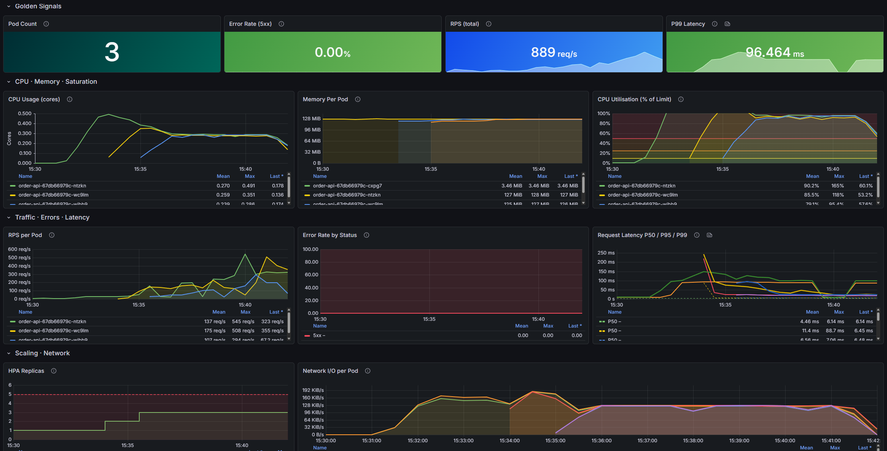

# Kubernetes Observability & Autoscaling Platform

A production-style Kubernetes platform demonstrating observability, security, and intelligent autoscaling using real-world tools.

## 📊 Observability Dashboard (Under Load)

This dashboard shows real-time system behaviour under load, including request throughput (~889 req/s), latency (P99), resource utilisation, and autoscaling activity.

## 🚀 Core Capabilities

- SLO-based autoscaling using KEDA
- Full observability stack (Prometheus, Grafana, Loki)
- Secure secrets management with HashiCorp Vault
- Ingress rate limiting & traffic control (NGINX)
- Threat detection with CrowdSec
- Microservices architecture (Flask-based APIs)

## 🏗 Architecture

- Kubernetes (k3s)
- Helm-based deployments
- PostgreSQL & Redis backend
- OpenTelemetry integration

## 📊 Observability Stack

- Prometheus → Metrics
- Grafana → Dashboards
- Loki → Logs

## 🔐 Security

- Vault dynamic secrets
- CrowdSec threat detection
- Ingress-level rate limiting

## 📁 Project Structure

- `apps/` → Microservices
- `charts/` → Helm charts
- `platform/` → Infrastructure components
- `automation/` → Internal tooling
- `configs/` → Alerts & configs

## 🎯 Key Highlights

- SLO-driven autoscaling based on real application health (not just CPU)
- End-to-end observability pipeline (metrics, logs, dashboards)
- Ingress-level traffic protection (rate limiting & IP throttling)
- Secure secret management using Vault with dynamic credentials
- Real-world validation through load testing and failure simulation

## 📊 Results & Validation

The platform was validated under controlled load testing scenarios::

- Availability maintained at ~99% under sustained traffic
- Autoscaling triggered dynamically (1 → 5 pods) using KEDA
- Malicious traffic successfully throttled at ingress level
- Error rate remained below 1% during stress testing
